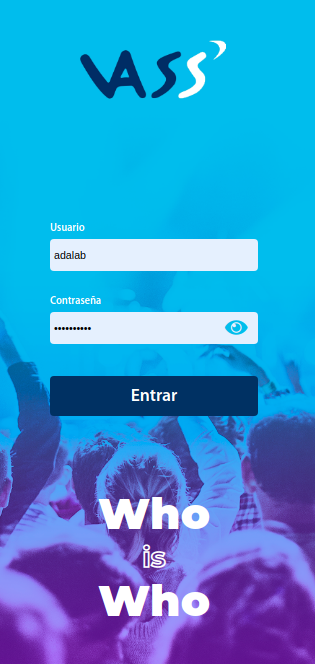

# WhoIsWho - VASS

A simple tool to contact your co-workers 🔍, allowing you to locate them easily via email or phone. The information is hosted on an API that requires authorization to access. 

This is a SPA created with [React JS](https://github.com/facebook/create-react-app).

## 🚀 Getting started

1. Clone the repository or fork it to your GitHub account.
2. To install packages:
  ### `npm install`
3. To launch the project and see it in your browser run: 
  ### `npm start`

## 🛠 Build
* [React](https://reactjs.org/) - Framework de JavaScript  ⚛︎
* [SASS](https://sass-lang.com/) - Preprocesador de estilos  🎨

## ✍️ About Us
We are a group of front-end developers that just finished the Adalab bootcamp. We are very grateful to have colaborated with a company like VASS for this project!

Ana Jaime - [anajd](https://github.com/anajd)
Arancha Narváez - [AranchaAdalab](https://github.com/AranchaAdalab)
Lara Rodríguez - [lararb](https://github.com/lararb)
Verónica Enamorado - [veroena](https://github.com/veroena)

## ⛩  Estructura

``` Index.js
  '
  ' - App.js
      ' - stylesheets
          ' - core
            ' - functions.scss
            ' - mixins.scss
            ' - variables.scss
          ' - layout
            ' - detail.scss
            ' - login.scss
            ' - search.scss
      ' - images
          ' - Background.png
          ' - login-mobile.png
          ' - Logo_Login.png
          ' - Logo_Search-Desk.png
          ' - Logo_Search.png
      ' - fonts
      ' - Components
          ' - Detail.js
          ' - Search.js
          ' - Login.js
```

## 🎁 Our thanks
To the VASS team that made this happen, Javier Pérez García, Mónica Hurtado, Samuel Berigüete, Abel Sánchez and Manuel.
And to you for taking interest in this project! If you have any questions or ideas to improve it, don't hesitate to contact us through the Issues. 


